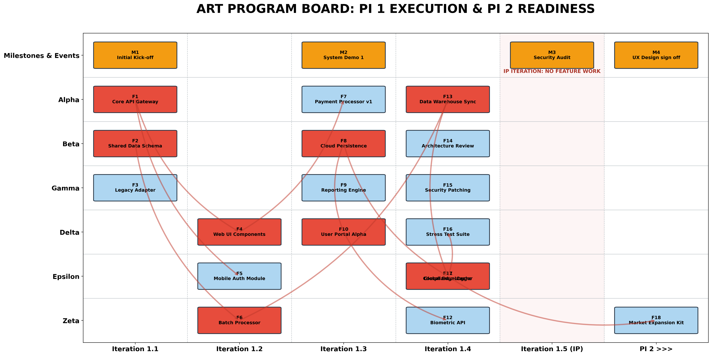

# Automated ART Board Generator

## Overview
In enterprise-scale delivery, the primary cause of failure is not lack of effort, but the **unseen friction of cross-team dependencies**. This ART Board Generator transforms static program backlogs into a high-fidelity **Program Board**. 

By enforcing SAFe governance rules—such as the **Innovation and Planning (IP) iteration blackout** and mandatory **UX Milestone alignment**—this engine ensures that a Release Train’s commitment is based on actual architectural flow rather than optimistic scheduling.

---

## Strategic Delivery Dashboard
*Visualization of inter-team dependency strings and value-stream milestones.*

---

## Key Strategic Metrics

| Metric | Business Significance | Strategic Action |
| :--- | :--- | :--- |
| **Dependency Saturation** | Tracks how "tangled" our teams are by counting the red strings. | If teams are too tangled, we split the work differently to stop them from blocking each other. |
| **IP Compliance Score** | Validates that Iteration 1.5 remains clear for innovation/planning. | Ensures the "Innovation Buffer" isn't consumed by feature overflow, protecting long-term agility. |
| **Milestone Convergence** | Shows which features must be "Done" to be included in specific demos or events. | If a feature misses its linked demo, we reschedule the showcase or adjust the participation list. |
| **Critical Path Depth** | Calculates the longest chain of sequential team dependencies. | Prioritizes "Foundational Teams" (e.g., Alpha) to prevent cascading delays across the train. |

---

## Dashboard Governance Analysis

### 1. Critical Path Fragility (The Red Strings)
* **Observation:** Multiple dependency strings originate from **Team Alpha (Iteration 1.1)** and terminate in downstream features across Delta and Epsilon.
* **Analysis:** Team Alpha is currently a **Systemic Bottleneck**. A minor delay in Alpha’s API Gateway development will trigger a "bullwhip effect," causing multi-week slips for the Mobile and Web UI workstreams.
* **Action Plan:** Implement a "Shared Service" model or cross-train Beta team members to support Alpha’s foundational work to de-risk the PI.

### 2. IP Sprint Integrity (Iteration 1.5)
* **Observation:** The visualization successfully highlights a 100% "Blackout Zone" in Iteration 1.5 (IP).
* **Analysis:** This provides the necessary capacity for the Security Audit (M3) and next PI Planning.
* **Action Plan:** Protect this buffer against late-stage scope creep to ensure the Release Train remains predictable.

### 3. Intra-Team Feature Density (Vertical Stacking)
* **Observation:** High feature density is detected in specific cells (e.g., Team Epsilon in Iteration 1.4).
* **Analysis:** Using the `cell_occupancy` logic, we’ve identified that Epsilon is running at maximum capacity. There is zero margin for error or defect resolution.
* **Action Plan:** Reallocate the secondary tasks to Team Gamma to balance the load and increase the probability of a successful "Done" state.

---

## Technology & Methodology
* **Engine:** Python-based `ARTProgramOrchestrator` utilizing a **Coordinate Mapping Algorithm** for dynamic dependency rendering.
* **Governance Rules:** 1. All **Red (Dependencies)** must resolve into **Blue (Working Software)**.
    2. All **Blue Features** must eventually feed into **Orange (Events/Milestones)**.
    3. **Orange Squares** are terminal "Sinks" and cannot lead to further work.
* **Risk Logic:** $$R_{chain} = \sum_{i=1}^{n} (Complexity_{i} \times Dependency\_Depth_{i})$$

---
